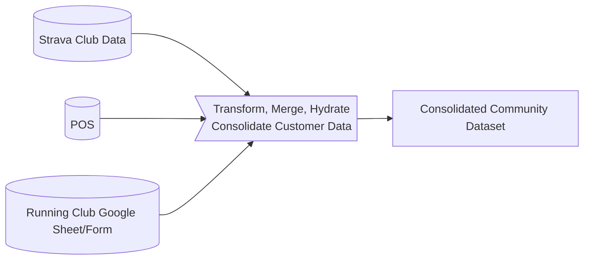

# Proposal for Project: Ampersand Ontoology

## TITLE: Ampersand Ontoology - Phased Data Integration and Engagement Project

## SITUATION APPRAISAL

Project Ampersand Ontoology aims to unify and transform customer POS data with community engagement data into actionable insights. By merging these data sources, such as Google Sheets, POS systems, and optionally Strava and Facebook, Ampersand intends to enhance customer loyalty and optimize community engagement initiatives. This proposal outlines a phased approach to build a sustainable, scalable solution to increase sales and customer participation through data-driven strategies.

## OBJECTIVES

1. **Data Consolidation and Transformation**: Integrate and normalize data from multiple sources to create a comprehensive data repository.
2. **Analytics and Optimization**: Utilize advanced analytics to derive insights that improve loyalty programs and marketing strategies.
3. **Operational Efficiency**: Streamline and automate data processes to maintain up-to-date customer insights.
4. **Customer Engagement and Retention**: Implement a loyalty system that leverages data insights to enhance customer engagement and retention.

## Visualization

## MEASURES

- **Data Integration Success**: Complete integration of designated data sources with a less than 1% error rate.
- **Campaign Performance**: Increase customer response rate by 25% through optimized marketing campaigns.
- **Operational Uptime**: Achieve 99% uptime for data pipelines and analytics infrastructure.
- **Customer Retention Rate**: Improve customer retention by 20% through targeted engagement strategies.

## VALUE

The successful implementation of this project will enable Ampersand to leverage comprehensive data insights to drive business decisions, resulting in enhanced community and customer analytics.

## TIMING

- **Kick-off**: Immediately upon agreement.
- **Duration**: Project to be implemented over 12 months with phases culminating in specific deliverables.

## METHODOLOGY

### Phase 1: Data Integration and Transformation
- **Merge Data**: Integrate datasets from Google Sheets and POS system for a holistic view.
- **Optional Enhancements**: Include data from Strava and Facebook to enrich the dataset.

**Deliverables**:
- **Dataset**: A comprehensive dataset that includes all relevant data from Google Sheets, POS system, and optionally Strava and Facebook.

### Phase 2: Analytics and Optimization
- **Data Utilization**: Use transformed data to fuel a loyalty and community engagement system.
- **Campaign Optimization**: Analyze joined data to refine marketing strategies, sales approaches, and customer interactions.

**Deliverables**:
- **Analysis**: A detailed analysis of the dataset, including insights on customer behavior, engagement patterns,etc.

### Phase 3: Operationalize and Maintain
- **Data Pipeline Maintenance**: Ensure continuous data updates and pipeline efficiency.
- **Marketing Automation**: Utilize data insights for targeted marketing campaigns via emails, newsletters, and SMS.
- **Infrastructure Hosting**: Manage and maintain the infrastructure required for ongoing data processing and analytics.

**Deliverables**:
- **Data Pipeline**: A reliable and efficient data pipeline that can handle continuous updates and reporting on the above-mentioned deliverables.

### OPTIONAL - Phase 4: NFT Rewards + Fort Worth DAO Partnership
- **NFT Rewards System**: Develop an NFT-based system to reward customer engagement.
- **Community Tokenization**: Use NFTs as badges and access tokens for exclusive community benefits.
- **DAO Partnership**: Establish a partnership with Fort Worth DAO to leverage NFTs as a means of funding community initiatives.

**Deliverables**:
- **NFT Rewards System**: A system that uses NFTs to incentivize customer engagement and participation.
- **Training and Education**: Provide training and education on the process of deploying rewards systems and community tokenization to staff and ambassadors.

## COST

- **Monthly Fee**: $99 per month.
- **Annual Fee**: $990 per year (offering a discount for annual commitment).

## TERMS

- **Payment Schedule**: Monthly or annual payments, with the annual option providing a discount.

## ACCEPTANCE

This proposal is presented for approval by Ampersand and is subject to further negotiation and agreement of final terms.

## PARTY 1 & 2

- **Entity 1**: YEETUM, LLC
- **Entity 2**: Ampersand Coffee

**Date**: June 10th, 2024

**Signatures**:

- **Party 1 Signature**: __________________________
- **Party 2 Signature**: __________________________
